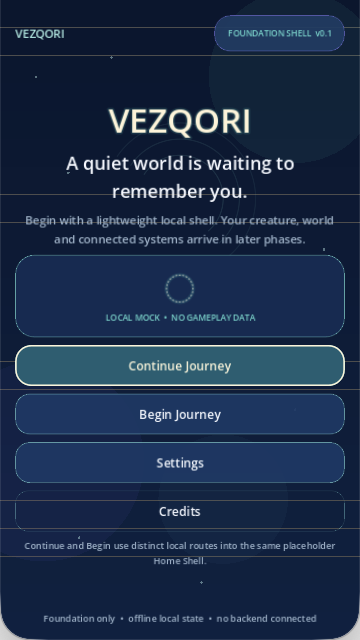
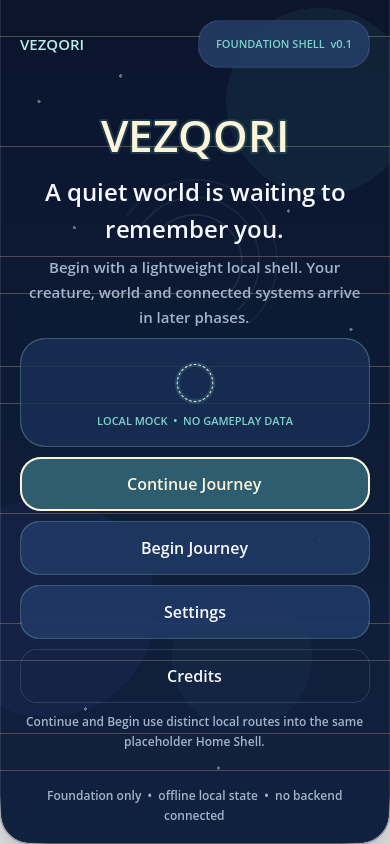
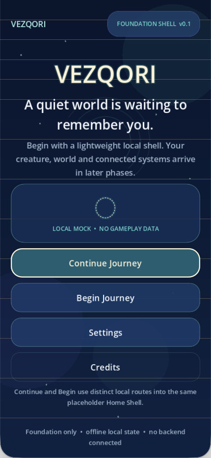
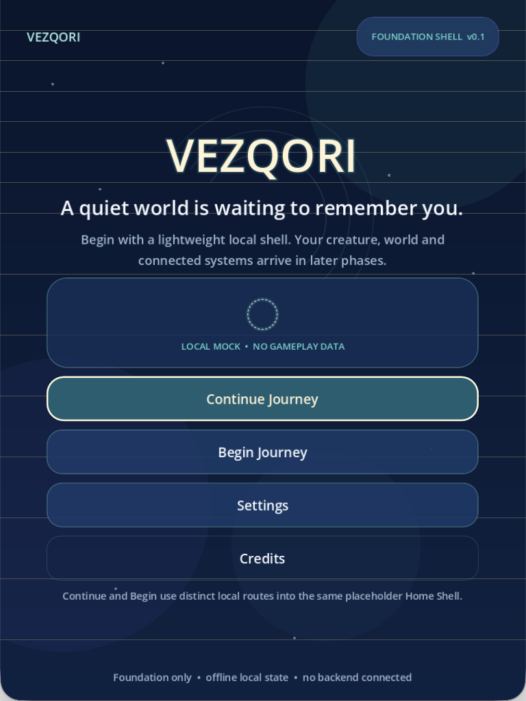
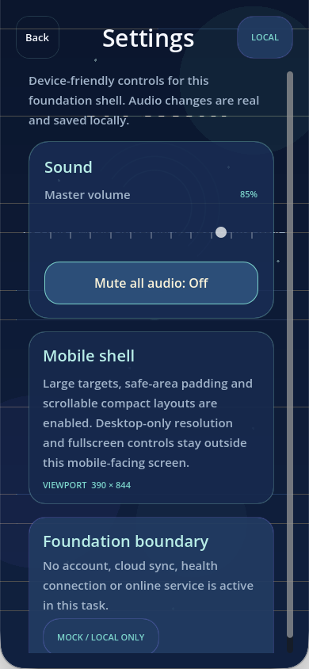
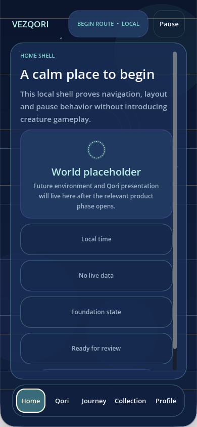
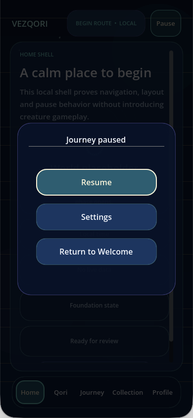

# TASK-001 Foundation Shell — Portrait Review Evidence

This directory is the curated, tracked PM-review set for **CORRECTION-001 — Portrait-Only Contract and PM-Reviewable Evidence**.

## Evidence provenance

- Source runtime/config commit: `db4f99a63bfb962c92b483c9c4e54f6bf64d8040`
- Branch: `feature/vezqori-foundation-shell`
- Draft PR: `woody-worakorn/Godot-Game-Template#1`
- Test/evidence date: `2026-09-19`
- Evidence curated at: `2026-09-19 22:21:52 +0700`
- Godot: `4.7.2.stable.official.ed1daf0bf`
- Portrait contract: [`PM_TASKS/DECISION-001_VEZQORI_PORTRAIT_ONLY.md`](../../../PM_TASKS/DECISION-001_VEZQORI_PORTRAIT_ONLY.md)
- Project settings under test:

  ```ini
  window/stretch/mode="canvas_items"
  window/stretch/aspect="expand"
  window/handheld/orientation=1
  ```

## Capture method

- Every PNG is an **actual Godot runtime window capture**, not an editor screenshot or generated mockup.
- The macOS title bar is **excluded** from the committed PNGs.
- The capture helper first captured the complete Retina-backed runtime window and then removed the 64-pixel macOS title-bar band.
- The resulting PNG dimensions are the exact requested game-content viewport dimensions.
- Full diagnostic captures and logs remain under ignored `.local-setup-logs/correction-001-portrait/`; only this selected review set is tracked.

## Portrait viewport results

| Screenshot | Game-content viewport | Effective logical canvas with `expand` | Result |
|---|---:|---:|---|
| `01-welcome-compact.png` | 360 × 640 | 474 × 844 | PASS — full portrait output, actions reachable, no unintended bars |
| `02-welcome-standard.png` | 390 × 844 | 390 × 844 | PASS — reference viewport |
| `03-welcome-tall.png` | 430 × 932 | 390 × 845 | PASS — tall composition remains anchored and fills output |
| `04-welcome-tablet.png` | 768 × 1024 | 633 × 844 | PASS — centered/bounded content, full portrait output |
| `05-settings-standard.png` | 390 × 844 | 390 × 844 | PASS — real Master volume at 85%, persistent local setting |
| `06-home-standard.png` | 390 × 844 | 390 × 844 | PASS — Home Shell and all five bottom tabs visible |
| `07-pause-standard.png` | 390 × 844 | 390 × 844 | PASS — Pause overlay fits without overflow |

The outer-edge analysis found a `0.0` near-black ratio on all four edges of every curated PNG; no unintended letterbox or pillarbox band was detected.

## Gallery

### Compact phone — 360 × 640



### Standard phone — 390 × 844



### Tall phone — 430 × 932



### Tablet portrait — 768 × 1024



### Settings — actual persisted audio setting



### Home Shell — five-tab bottom navigation



### Pause overlay



## SHA-256 manifest

| File | SHA-256 |
|---|---|
| `01-welcome-compact.png` | `b651b396c7023a130930754a1b40fcaf6c1285cff284b367cf0b33e42d0fa999` |
| `02-welcome-standard.png` | `5a1d497f8ac0e81318d6726ee3a70119063cabb184e1e4cf6b64b31d417ef853` |
| `03-welcome-tall.png` | `0c53fd033be73208e6151ba7647708aa24f44605a609b2eccd148e97421460fb` |
| `04-welcome-tablet.png` | `c21f4c7c0faeff074c892076e526f573c98e8551dcd3bd908c52288227a03924` |
| `05-settings-standard.png` | `bbb427f79cae30f622ec03d99192a3375fa0f9403a5e8c848b9eaed23363af16` |
| `06-home-standard.png` | `373109cd1e0e33cba655e3acf3ff20ded0f6ae8666f38071a1ac8560dd777d93` |
| `07-pause-standard.png` | `0e0a196c577c982c299172f21f02196255b3baacb2632adec619129fe4054342` |

## Known visual limitations

1. These captures validate macOS portrait runtime windows; physical-device safe-area/notch behavior still requires iOS and Android device validation before release.
2. The opening sequence still preserves the foundation Godot splash before the VEZQORI Welcome screen.
3. Home, Qori, Journey, Collection, and Profile content remains explicitly local/mock placeholder content.
4. The current build uses project/system typography because a final licensed VEZQORI brand font has not been supplied.
5. The tablet composition is intentionally bounded instead of stretching individual cards edge-to-edge.
6. Shutdown-only ObjectDB diagnostics are documented in `VEZQORI_FOUNDATION_SHELL_V0_1.md`; no live parser, script, missing-resource, navigation, or layout failure occurred in this review run.
